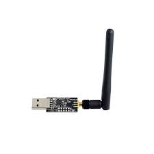
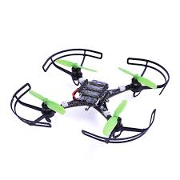
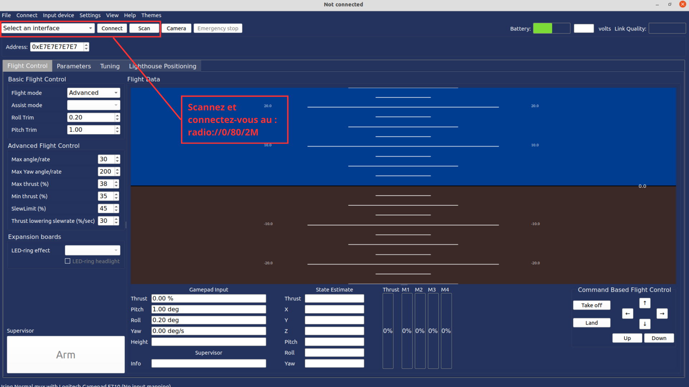
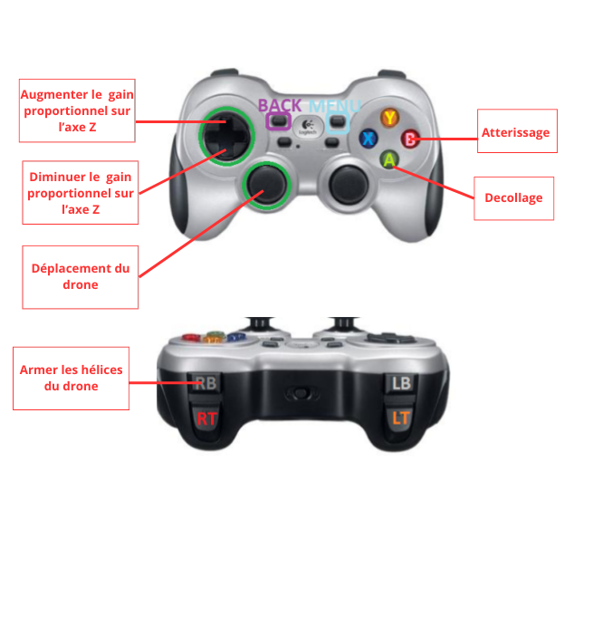
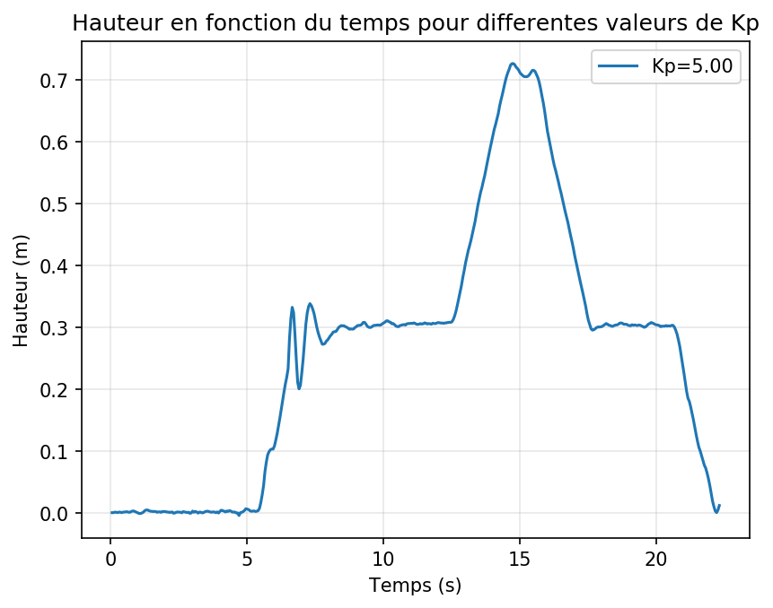
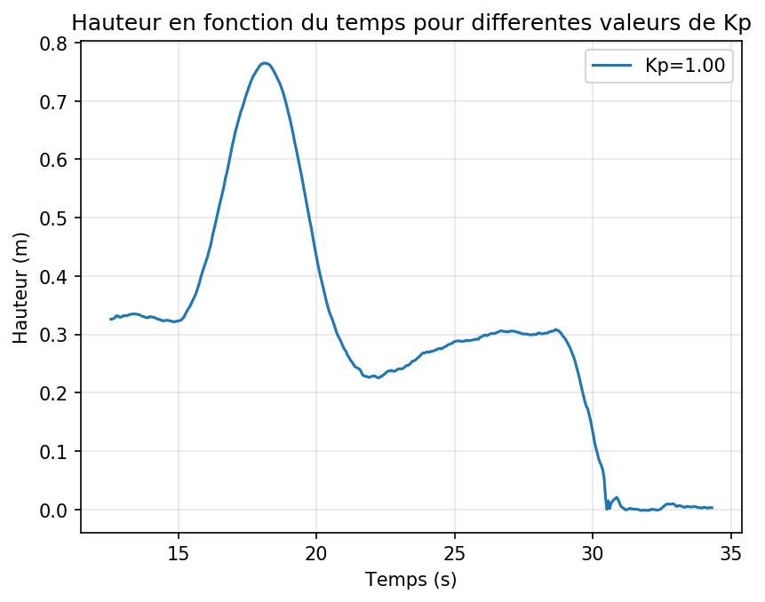
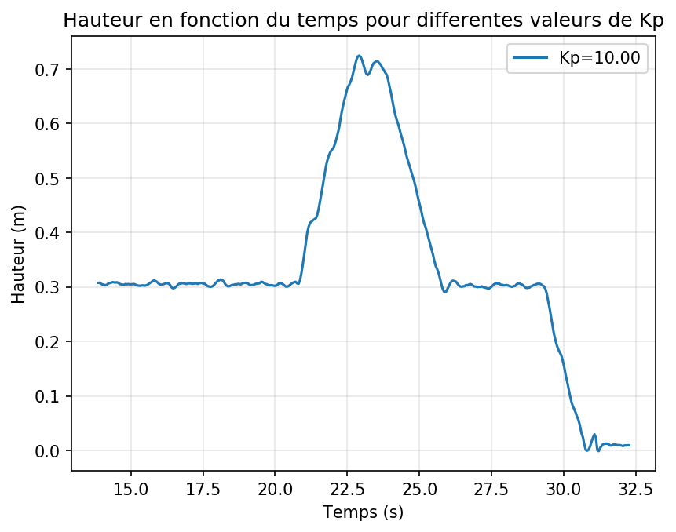

# Tutoriel d'utilisation

Ce guide montre, de façon concrète, l'effet des gains du PID. On commence par l'observer en simulation avec CrazySim, puis on reproduit la même séquence en réel avec le drone. L'objectif est de voir comment le Kp influence la stabilité verticale, d'abord en environnement contrôlé, puis en conditions réelles.

## Vue d'ensemble des tâches
1. Lancer le simulateur (CrazySim) et se connecter avec cfclient.
2. Tester les commandes de base en simulation.
3. Connecter le drone réel via cfclient et vérifier la manette.
4. Lancer le script Python et exécuter les séquences.
5. Ajuster Kp avec le D-Pad et observer la stabilité.
6. Sauvegarder le CSV et generer les courbes (PNG).

## Partie 1 : CrazySim

Objectif : observer sans risque l'effet du Kp sur la stabilité en hauteur. Le simulateur sert de référence avant les tests réels.

### 1) Lancer CrazySim (simulateur)
1. Ouvre un terminal et va dans `CrazySim/crazyflie-firmware` :
   ```bash
   cd CrazySim/crazyflie-firmware
   ```
2. Lance un simulateur (exemple 1 drone) :
   ```bash
   bash tools/crazyflie-simulation/simulator_files/gazebo/launch/sitl_singleagent.sh -m crazyflie -x 0 -y 0
   ```
3. Garde ce terminal ouvert (le simulateur tourne tant que la commande tourne).

### 2) Ouvrir cfclient et se connecter au drone simulé
1. Ouvre un autre terminal et lance le client :
   ```bash
   cfclient
   ```
2. Active le mode SITL dans la fenêtre de connexion : coche la case **SITL** (ou "Simulator") en haut de la liste des interfaces.
3. Clique sur **Scan**, puis **Connect**.
4. La connexion doit se faire avec l'URI `udp://0.0.0.0:19850`.

Image de connexion :


### 3) Commander le drone dans le simulateur
1. Utilise les contrôles de vol dans cfclient pour faire décoller et déplacer le drone.
2. Les commandes du client pilotent le drone simulé en direct.

Image de contrôle :


### 4) Contrôle du PID dans CrazySim
1. Ouvre l'onglet ou panneau de tuning PID.
2. Modifie les gains et observe l'effet sur la stabilité.

Image PID :


Vidéo de démonstration PID :

https://github.com/user-attachments/assets/82c20c6d-2d48-4feb-b318-7accf0861831

---

## Partie 2 : cfclient (drone réel)

Objectif : reproduire les mêmes réglages sur le drone physique et valider les sensations et la stabilité en vol réel.

### 1) Ouvrir le logiciel cfclient
1. Branche la Crazyradio.
2. Lance `cfclient` :
   ```bash
   cfclient
   ```

### 2) Identifier le matériel
Crazyradio PA :



Drone Crazyflie :



### 3) Se connecter au drone via radio
1. Dans cfclient, clique sur Scan.
2. Sélectionne l'URI radio détecté.
3. Clique sur Connect.



### 4) Choisir la configuration de manette (profil)
1. Ouvre la configuration des inputs (joystick).
2. Choisis le profil `drone_PID_kp`.
3. Clique sur Load, puis Save.

### 5) Fonctions principales de la manette
Les actions ci-dessous suivent le profil `drone_PID_kp` :

- Stick gauche : thrust (gaz) + yaw.
- Stick droit : roll + pitch.
- Triangle : lance la séquence de test (monte à 0.7 m puis redescend à 0.3 m).
- Croix / Carre / Rond : selon ta configuration, garde ces boutons pour l'usage standard.
- L1/R1/L2/R2 : selon ta manette, fonctions secondaires.
- L3/R3 : clics sticks, si assignes.
- Options/Share/PS : actions systeme ou exit si configure.

### 6) Modifier les paramètres PID dans le client
1. Ouvre l'onglet PID ou Tuning.
2. Change les gains (Kp, Ki, Kd) et observe la stabilité.
3. Sauvegarde les valeurs si nécessaire.

---

## Partie 3 : code Python pour le vol (séquence Kp)

Objectif : automatiser une séquence courte pour comparer rapidement Kp faible, moyen et fort sur l'axe Z.

### 1) Lancer le script
1. Branche le drone (Crazyradio) ou utilise le simulateur.
2. Active l'environnement Python si besoin.
3. Lance le script Python :
   ```bash
   python3 controle_python_crazyflie/vol.py
   ```

### 2) Commandes manette (script Python)
Remarque : le mapping peut varier selon la manette et le système (PS4, Logitech, Linux/macOS).
Le script affiche un mapping au démarrage si besoin.

| Touche | Action |
| --- | --- |
| Croix | Décollage à 0.3 m et stationnaire (active le contrôle joystick). |
| Triangle | Lance la séquence (monte à 0.7 m, revient à 0.3 m). |
| Cercle | Atterrissage doux (désactive le contrôle joystick). |
| Carré | Atterrissage puis fermeture du script. |
| L1 | Séquence auto (décollage 0.3 m, avance 0.5 m, demi-tour, retour 0.5 m, demi-tour, atterrissage). |
| R1 | Armer / désarmer le drone. |
| L2 (clic) | Aucune action (log uniquement). |
| R2 (clic) | Aucune action (log uniquement). |
| Share | Aucune action (log uniquement). |
| Options | Aucune action (log uniquement). |
| PS | Aucune action (log uniquement). |
| Touchpad | Aucune action (log uniquement). |
| Clic stick gauche | Aucune action (log uniquement). |
| Clic stick droit | Aucune action (log uniquement). |
| D-Pad haut | Augmente le Kp (min 0.5, max 10). |
| D-Pad bas | Diminue le Kp (min 0.5, max 10). |
| D-Pad gauche | Aucune action. |
| D-Pad droite | Aucune action. |
| Joystick gauche | Mouvements horizontaux (X/Y). |
| Joystick droit | Non utilisé (rotation désactivée). |

Image manette :



Séquence 2 :

Séquence 2 (bouton L1) : décollage à 0.3 m, avance de 0.5 m, demi-tour 180 deg,
retour de 0.5 m, demi-tour pour reprendre l'orientation initiale, puis atterrissage.
Le contrôle joystick est suspendu pendant la séquence.

https://github.com/user-attachments/assets/5f72a65c-38d6-40a5-bcae-7168a57ea5e6

### 3) Observer l'effet de Kp sur l'axe Z
Utilise Triangle pour répéter la séquence et comparer la stabilité.

Valeurs testées :
-  Kp minimal (1).
-  Kp maximal (10).
-  Kp normal (5).

Séquence 1 :

Séquence 1 (bouton Triangle) : décollage à 0.3 m, montée à 0.7 m,
retour à 0.3 m puis stationnaire. Le contrôle joystick est suspendu
pendant la séquence.

https://github.com/user-attachments/assets/59a65315-ffc7-4fc4-8205-720f6ee32596


### 4) Logs et courbes (CSV/PNG)
Le script enregistre la hauteur en fonction du temps et du Kp. Le CSV est créé à la fin du script
(sortie propre, bouton Carré) dans `flight_logs/height_vs_time_YYYYMMDD_HHMMSS.csv`.

Tracer une courbe (un CSV) :
```bash
python3 controle_python_crazyflie/plot_k_height.py flight_logs/height_vs_time_YYYYMMDD_HHMMSS.csv
```
Tracer plusieurs CSV en images séparées (par défaut) :

```bash
python3 controle_python_crazyflie/plot_k_height.py flight_logs/height_vs_time_*.csv
```

Tracer plusieurs CSV sur une seule image :
```bash
python3 controle_python_crazyflie/plot_k_height.py flight_logs/height_vs_time_*.csv --combine
```

Les images sont sauvegardées dans `flight_logs/plots/`.

Courbes générées (exemples) :





---

## Synthèse finale : effet du Kp sur l'axe Z

En manipulant Kp, on observe directement l'impact sur la stabilité verticale. Un Kp faible corrige lentement : le drone répond avec retard et peut rester en dessous de la hauteur cible. Un Kp trop élevé corrige trop fort : on voit des oscillations et une instabilité autour de la consigne. Un Kp moyen offre un compromis : la montée est propre, l'arrêt à la hauteur cible est plus net, et le stationnaire est plus stable.

---

## Conseils rapides
- Toujours tester d'abord en simulateur.
- Commencer avec un Kp moyen (ex: 5) puis ajuster par petits pas.
- Garder une zone de sécurité dégagée pour les tests réels.
