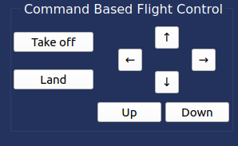
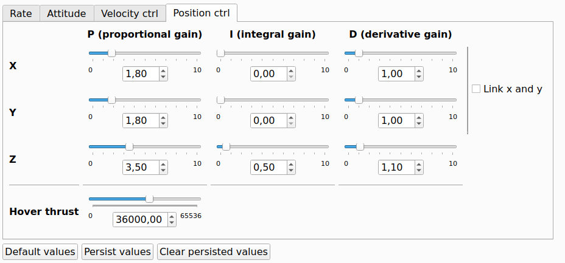

# Tutoriel d'utilisation

Ce guide montre, de facon concrete, l'effet des gains du PID. On commence par l'observer en simulation avec CrazySim, puis on reproduit la meme sequence en reel avec le drone. L'objectif est simple : voir comment le Kp influence la stabilite verticale, d'abord en environnement controle, puis en conditions reelles.

## Partie 1 : CrazySim

Objectif : observer sans risque l'effet du Kp sur la stabilite en hauteur. Le simulateur sert de reference avant les tests reels.

### 1) Lancer CrazySim (simulateur)
1. Ouvre un terminal et va dans `CrazySim/crazyflie-firmware` :
   ```bash
   cd CrazySim/crazyflie-firmware
   ```
2. Lance un simulateur (exemple 1 drone) :
   ```bash
   bash tools/crazyflie-simulation/simulator_files/gazebo/launch/sitl_singleagent.sh -m crazyflie -x 0 -y 0
   ```
3. Garde ce terminal ouvert (le simulateur tourne tant que la commande tourne).

### 2) Ouvrir cfclient et se connecter au drone simule
1. Ouvre un autre terminal et lance le client :
   ```bash
   cfclient
   ```
2. Active le mode SITL dans la fenetre de connexion : coche la case **SITL** (ou "Simulator") en haut de la liste des interfaces.
3. Clique sur **Scan**, puis **Connect**.
4. La connexion doit se faire avec l'URI `udp://0.0.0.0:19850`.

Image de connexion :


### 3) Commander le drone dans le simulateur
1. Utilise les controles de vol dans cfclient pour faire decoller et deplacer le drone.
2. Les commandes du client pilotent le drone simule en direct.

Image de controle :



### 4) Controle du PID dans CrazySim
1. Ouvre l'onglet ou panneau de tuning PID.
2. Modifie les gains et observe l'effet sur la stabilite.

Image PID :



Video de demonstration PID :

https://github.com/gtfactslab/Llanes_ICRA2024/assets/40842920/b865127c-1b0d-4f49-941d-e57aecda9a54

---

## Partie 2 : cfclient (drone reel)

Objectif : reproduire les memes reglages sur le drone physique et valider les sensations et la stabilite en vol reel.

### 1) Ouvrir le logiciel cfclient
1. Branche la Crazyradio.
2. Lance `cfclient` :
   ```bash
   cfclient
   ```

### 2) Identifier le materiel
Crazyradio PA :


Drone Crazyflie :


### 3) Se connecter au drone via radio
1. Dans cfclient, clique sur Scan.
2. Selectionne l'URI radio detecté.
3. Clique sur Connect.


### 4) Choisir la configuration de manette (profil)
1. Ouvre la configuration des inputs (joystick).
2. Choisis le profil `drone_PID_kp`.
3. Clique sur Load, puis Save.

### 5) Fonctions principales de la manette
Les actions ci-dessous suivent le profil `drone_PID_kp` :

- Stick gauche : thrust (gaz) + yaw.
- Stick droit : roll + pitch.
- Triangle : lance la sequence de test (monte a 0.7 m puis redescend a 0.3 m).
- Croix / Carre / Rond : selon ta configuration, garde ces boutons pour l'usage standard.
- L1/R1/L2/R2 : selon ta manette, fonctions secondaires.
- L3/R3 : clics sticks, si assignes.
- Options/Share/PS : actions systeme ou exit si configure.

### 6) Modifier les parametres PID dans le client
1. Ouvre l'onglet PID ou Tuning.
2. Change les gains (Kp, Ki, Kd) et observe la stabilité.
3. Sauvegarde les valeurs si necessaire.

---

## Partie 3 : code Python pour le vol (sequence Kp)

Objectif : automatiser une sequence courte pour comparer rapidement Kp faible, moyen et fort sur l'axe Z.

### 1) Lancer le script
1. Branche le drone (Crazyradio) ou utilise le simulateur.
2. Active l'environnement Python si besoin.
3. Lance le script Python :
   ```bash
   python controle_python_crazyflie/vol.py
   ```

### 2) Commandes manette (script Python)
- Croix : decollage a 0.3 m et stationnaire.
- Triangle : lance la sequence (monte a 0.7 m, revient a 0.3 m).
- Cercle : atterrissage doux.
- D-Pad haut/bas : augmente/diminue le Kp (min 0.5, max 10).
-Joystick gauche : mouvements du drone

Image manette :


### 3) Observer l'effet de Kp sur l'axe Z
Utilise Triangle pour repeter la sequence et comparer la stabilité.

Valeurs testées :
-  Kp minimal (1).
-  Kp maximal (10).
-  Kp normal (5).

[Voir la video du test réel du PID sur le drone](video_drone.mp4)

---

## Synthese finale : effet du Kp sur l'axe Z

En manipulant Kp, on observe directement l'impact sur la stabilite verticale. Un Kp faible corrige lentement : le drone repond avec retard et peut rester en dessous de la hauteur cible. Un Kp trop eleve corrige trop fort : on voit des oscillations et une instabilite autour de la consigne. Un Kp moyen offre un compromis : la montee est propre, l'arret a la hauteur cible est plus net, et le stationnaire est plus stable.

---

## Conseils rapides
- Toujours tester d'abord en simulateur.
- Commencer avec un Kp moyen (ex: 5) puis ajuster par petits pas.
- Garder une zone de securite degagee pour les tests reels.
